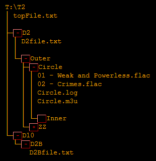

##tree2
Enhanced version of Windows tree.exe command.

#### Syntax

`tree2 [drive:][path] [/F] [/A] [/W] [/2]`

`/F   `Display the names of the files in each folder.<br/>
`/A   `Use ASCII instead of extended characters.  
`/W   `Produce output suitable for a static HTML web page.  
`/2   `Indent by 2 instead of 4.

The two switches that this version adds to the Windows utility are '/W' and '/2'.
The '/W' switch produces a single web page that displays a tree view of the directory structure -
similar to the folder viewers of file managers.

#### Examples

```
<b>T:\> tree2 /a /f /2 t:\t2</b>
T:\T2
|   topFile.txt
|
+---D2
|   |   d1File.txt
|   |
|   \---Outer
|       +---Circle
|       |   |   01 - Weak and Powerless.flac
|       |   |   02 - Crimes.flac
|       |   |   Circle.log
|       |   |   Circle.m3u
|       |   |
|       |   \---Inner
|       \---ZZ
|               zzFile.txt
|
\---D10
    \---D2B
            d2bfile.txt
            
T:\> tree2 /a /w /2 /f t:\t2 > t:\dirPage.html
```

The output of the `/W` switch produces a web page as seen below.


